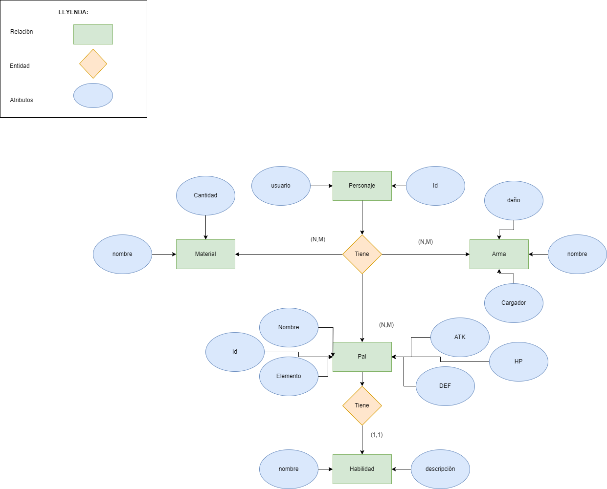
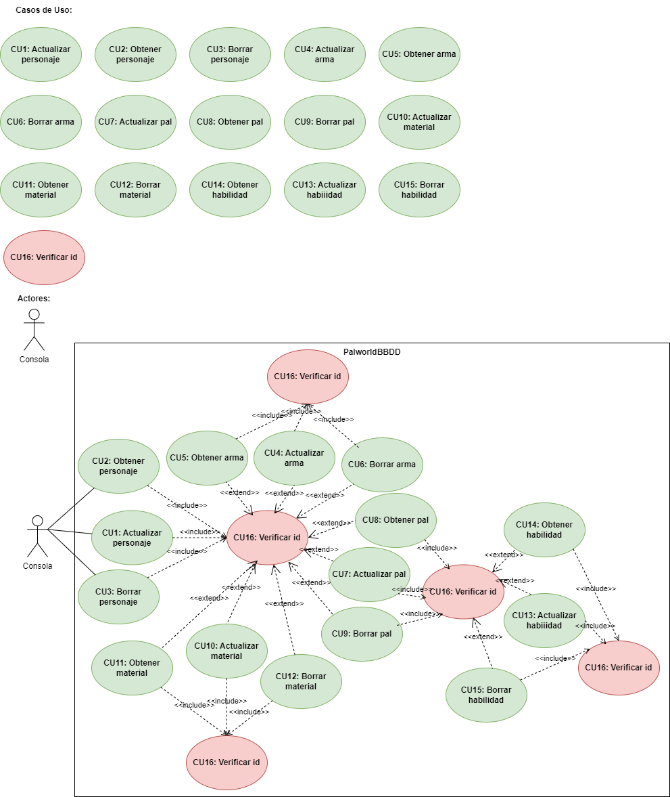
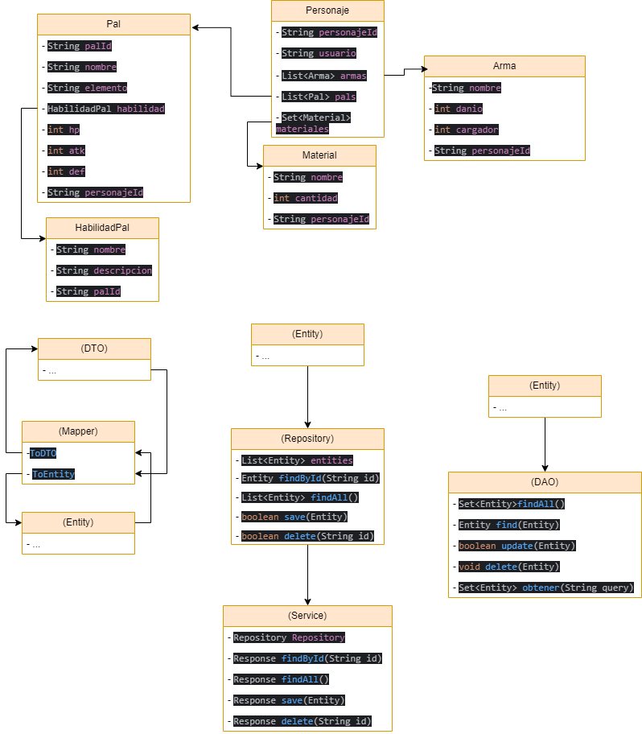
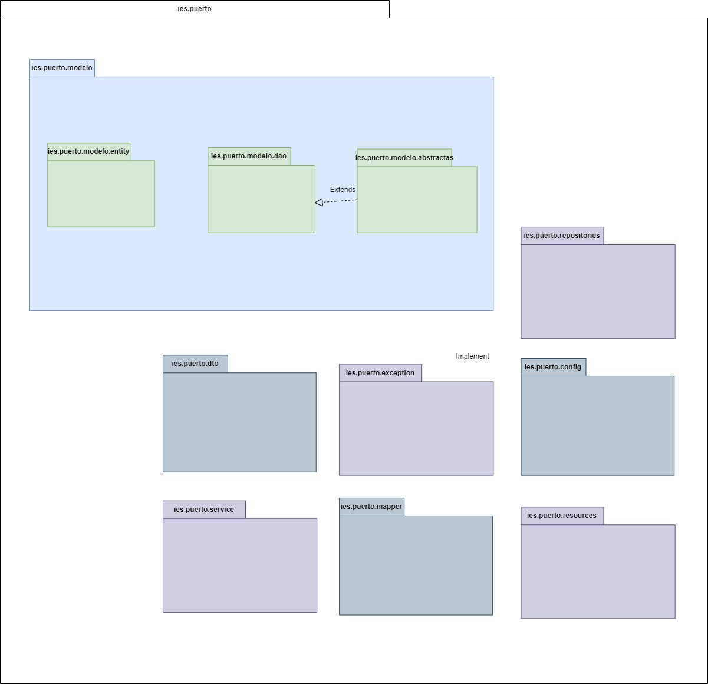

<h1>Carpeta con los diagramas del proyecto</h1>

<h1>Indice</h1>

- [Diagrama Entidad-Relación](#diagrama-de-entidad-relacion)
- [Diagrama de Casos de Uso](#diagrama-de-casos-de-uso)
- [Diagrama de clases](#diagrama-de-clases)
- [Diagrama de Paquetes](#diagrama-de-paquetes)

En esta se alojara toda la documentación relacionada con los diferentes diagramas del proyecto.

## Diagrama de Entidad-Relacion

## Diagrama de Casos de Uso

### Tablas
|  Caso de Uso	CU | 1  |
  |---|---|
| Fuentes  | _https://github.com/jpexposito/docencia/tree/master/Primero/ETS/PROYECTO_  |
| Actor  |  _Consola_ |
| Descripción | _Actualizar personaje_  |
| Flujo básico | _1-Actualizar personaje_ |
| Pre-condiciones | _M/D_  |  
| Post-condiciones  | _N/D_  |  
|  Requerimientos | _Verificar id_  |
|  Notas |  _N/D_ |
| Autor  | _Daniel Alejandro Rodriguez Herrera_ |
|Fecha | _01/05/2024_ |

|  Caso de Uso	CU | 2  |
  |---|---|
| Fuentes  | _https://github.com/jpexposito/docencia/tree/master/Primero/ETS/PROYECTO_  |
| Actor  |  _Consola_ |
| Descripción | _Obtener personaje_  |
| Flujo básico | _1-Obtener personaje_ |
| Pre-condiciones | _M/D_  |  
| Post-condiciones  | _N/D_  |  
|  Requerimientos | _Verificar id_  |
|  Notas |  _N/D_ |
| Autor  | _Daniel Alejandro Rodriguez Herrera_ |
|Fecha | _01/05/2024_ |

|  Caso de Uso	CU | 3  |
  |---|---|
| Fuentes  | _https://github.com/jpexposito/docencia/tree/master/Primero/ETS/PROYECTO_  |
| Actor  |  _Consola_ |
| Descripción | _Borrar personaje_  |
| Flujo básico | _1-Borrar personaje_ |
| Pre-condiciones | _M/D_  |  
| Post-condiciones  | _N/D_  |  
|  Requerimientos | _Verificar id_  |
|  Notas |  _N/D_ |
| Autor  | _Daniel Alejandro Rodriguez Herrera_ |
|Fecha | _01/05/2024_ |

|  Caso de Uso	CU | 4  |
  |---|---|
| Fuentes  | _https://github.com/jpexposito/docencia/tree/master/Primero/ETS/PROYECTO_  |
| Actor  |  _Consola_ |
| Descripción | _Actualizar arma_  |
| Flujo básico | _1-Actualizar arma_ |
| Pre-condiciones | _M/D_  |  
| Post-condiciones  | _N/D_  |  
|  Requerimientos | _Verificar id_  |
|  Notas |  _N/D_ |
| Autor  | _Daniel Alejandro Rodriguez Herrera_ |
|Fecha | _01/05/2024_ |

|  Caso de Uso	CU | 5  |
  |---|---|
| Fuentes  | _https://github.com/jpexposito/docencia/tree/master/Primero/ETS/PROYECTO_  |
| Actor  |  _Consola_ |
| Descripción | _Obtener arma_  |
| Flujo básico | _1-Obtener arma_ |
| Pre-condiciones | _M/D_  |  
| Post-condiciones  | _N/D_  |  
|  Requerimientos | _Verificar id_  |
|  Notas |  _N/D_ |
| Autor  | _Daniel Alejandro Rodriguez Herrera_ |
|Fecha | _01/05/2024_ |

|  Caso de Uso	CU | 6  |
  |---|---|
| Fuentes  | _https://github.com/jpexposito/docencia/tree/master/Primero/ETS/PROYECTO_  |
| Actor  |  _Consola_ |
| Descripción | _Borrar arma_  |
| Flujo básico | _1-Borrar arma_ |
| Pre-condiciones | _M/D_  |  
| Post-condiciones  | _N/D_  |  
|  Requerimientos | _Verificar id_  |
|  Notas |  _N/D_ |
| Autor  | _Daniel Alejandro Rodriguez Herrera_ |
|Fecha | _01/05/2024_ |
|  Caso de Uso	CU | 7  |
  |---|---|
| Fuentes  | _https://github.com/jpexposito/docencia/tree/master/Primero/ETS/PROYECTO_  |
| Actor  |  _Consola_ |
| Descripción | _Actualizar pal_  |
| Flujo básico | _1-Actualizar pal_ |
| Pre-condiciones | _M/D_  |  
| Post-condiciones  | _N/D_  |  
|  Requerimientos | _Verificar id_  |
|  Notas |  _N/D_ |
| Autor  | _Daniel Alejandro Rodriguez Herrera_ |
|Fecha | _01/05/2024_ |

|  Caso de Uso	CU | 8  |
  |---|---|
| Fuentes  | _https://github.com/jpexposito/docencia/tree/master/Primero/ETS/PROYECTO_  |
| Actor  |  _Consola_ |
| Descripción | _Obtener pal_  |
| Flujo básico | _1-Obtener pal_ |
| Pre-condiciones | _M/D_  |  
| Post-condiciones  | _N/D_  |  
|  Requerimientos | _Verificar id_  |
|  Notas |  _N/D_ |
| Autor  | _Daniel Alejandro Rodriguez Herrera_ |
|Fecha | _01/05/2024_ |

|  Caso de Uso	CU | 9  |
  |---|---|
| Fuentes  | _https://github.com/jpexposito/docencia/tree/master/Primero/ETS/PROYECTO_  |
| Actor  |  _Consola_ |
| Descripción | _Borrar pal_  |
| Flujo básico | _1-Borrar pal_ |
| Pre-condiciones | _M/D_  |  
| Post-condiciones  | _N/D_  |  
|  Requerimientos | _Verificar id_  |
|  Notas |  _N/D_ |
| Autor  | _Daniel Alejandro Rodriguez Herrera_ |
|Fecha | _01/05/2024_ |

|  Caso de Uso	CU | 10  |
  |---|---|
| Fuentes  | _https://github.com/jpexposito/docencia/tree/master/Primero/ETS/PROYECTO_  |
| Actor  |  _Consola_ |
| Descripción | _Actualizar material_  |
| Flujo básico | _1-Actualizar material_ |
| Pre-condiciones | _M/D_  |  
| Post-condiciones  | _N/D_  |  
|  Requerimientos | _Verificar id_  |
|  Notas |  _N/D_ |
| Autor  | _Daniel Alejandro Rodriguez Herrera_ |
|Fecha | _01/05/2024_ |

|  Caso de Uso	CU | 11  |
  |---|---|
| Fuentes  | _https://github.com/jpexposito/docencia/tree/master/Primero/ETS/PROYECTO_  |
| Actor  |  _Consola_ |
| Descripción | _Obtener material_  |
| Flujo básico | _1-Obtener material_ |
| Pre-condiciones | _M/D_  |  
| Post-condiciones  | _N/D_  |  
|  Requerimientos | _Verificar id_  |
|  Notas |  _N/D_ |
| Autor  | _Daniel Alejandro Rodriguez Herrera_ |
|Fecha | _01/05/2024_ |

|  Caso de Uso	CU | 12  |
  |---|---|
| Fuentes  | _https://github.com/jpexposito/docencia/tree/master/Primero/ETS/PROYECTO_  |
| Actor  |  _Consola_ |
| Descripción | _Borrar material_  |
| Flujo básico | _1-Borrar material_ |
| Pre-condiciones | _M/D_  |  
| Post-condiciones  | _N/D_  |  
|  Requerimientos | _Verificar id_  |
|  Notas |  _N/D_ |
| Autor  | _Daniel Alejandro Rodriguez Herrera_ |
|Fecha | _01/05/2024_ |

|  Caso de Uso	CU | 13  |
  |---|---|
| Fuentes  | _https://github.com/jpexposito/docencia/tree/master/Primero/ETS/PROYECTO_  |
| Actor  |  _Consola_ |
| Descripción | _Actualizar habilidad_  |
| Flujo básico | _1-Actualizar habilidad_ |
| Pre-condiciones | _M/D_  |  
| Post-condiciones  | _N/D_  |  
|  Requerimientos | _Verificar id_  |
|  Notas |  _N/D_ |
| Autor  | _Daniel Alejandro Rodriguez Herrera_ |
|Fecha | _01/05/2024_ |

|  Caso de Uso	CU | 14  |
  |---|---|
| Fuentes  | _https://github.com/jpexposito/docencia/tree/master/Primero/ETS/PROYECTO_  |
| Actor  |  _Consola_ |
| Descripción | _Obtener habilidad_  |
| Flujo básico | _1-Obtener habilidad_ |
| Pre-condiciones | _M/D_  |  
| Post-condiciones  | _N/D_  |  
|  Requerimientos | _Verificar id_  |
|  Notas |  _N/D_ |
| Autor  | _Daniel Alejandro Rodriguez Herrera_ |
|Fecha | _01/05/2024_ |

|  Caso de Uso	CU | 15  |
  |---|---|
| Fuentes  | _https://github.com/jpexposito/docencia/tree/master/Primero/ETS/PROYECTO_  |
| Actor  |  _Consola_ |
| Descripción | _Borrar habilidad_  |
| Flujo básico | _1-Borrar habilidad_ |
| Pre-condiciones | _M/D_  |  
| Post-condiciones  | _N/D_  |  
|  Requerimientos | _Verificar id_  |
|  Notas |  _N/D_ |
| Autor  | _Daniel Alejandro Rodriguez Herrera_ |
|Fecha | _01/05/2024_ |

|  Caso de Uso	CU | 16  |
  |---|---|
| Fuentes  | _https://github.com/jpexposito/docencia/tree/master/Primero/ETS/PROYECTO_  |
| Actor  |  _Jugador_ |
| Descripción | _Verificar id_  |
| Flujo básico | _1-Agregar/Cambiar/Buscar [] > 2-Verificar id_ |
| Pre-condiciones | _Agregar/Cambiar/Buscar []_  |  
| Post-condiciones  | _(Opcionales)_  |  
|  Requerimientos | _N/D_  |
|  Notas |  _La id es distinta para cada concepto []_ |
| Autor  | _Daniel Alejandro Rodriguez Herrera_ |
|Fecha | _20/03/2024_ |

## Diagrama de clases 

## Diagrama de Paquetes
 